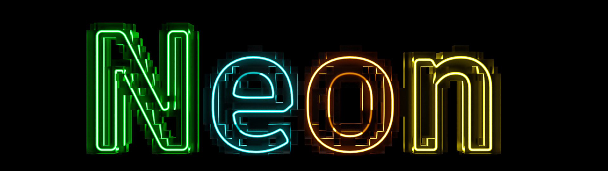

Neon is a research framework for programming multi-device systems maintained by [Autodesk Research](https://www.autodesk.com/research/overview). Neon's goal is to automatically transform user sequential code into, for example, a scalable multi-GPU execution.

To reach its goal, Neon takes a domain-specific approach based on the parallel skeleton philosophy (a.k.a parallel patterns). Neon provides a set of domain-specific and programmable patterns that users compose through a sequential programming model to author their applications. Then, thanks to the knowledge of the domain, the patterns and their composition, Neon automatically optimizes the sequential code into an execution optimized for multi-device systems.

Currently, Neon targets grid-based computations on multi-core CPUs or single node multi-GPU systems. 

It is important to keep in mind that Neon is a research project in continuous evolution. So, while we have successfully tested the system with different applications (Finite Difference, Finite Element, Lattice Boltzmann Method), Neon interfaces may change between versions to introduce new capabilities.

## Quick Start

Neon code is hosted on a GitHub [repository](https://github.com/Autodesk/Neon).
To clone the repo, use the command:

```
git clone https://github.com/Autodesk/Neon
```

### Python Installation

Neon provides Python bindings that integrate with [NVIDIA Warp](https://github.com/NVIDIA/warp) for GPU-accelerated computing. The wheel includes a bundled version of Warp, so no separate installation is needed.

#### Prerequisites

- Python 3.8 or newer
- CUDA Toolkit 12.0 or later
- NVIDIA GPU with compute capability 5.2 or higher

#### Installing from Pre-built Wheel (Recommended)

The easiest way to install Neon is from a pre-built wheel that includes both Neon and Warp. Download from GitHub Releases:

```bash
pip install https://github.com/Autodesk/Neon/releases/download/v0.3.3/neon_gpu-0.3.3-cp312-cp312-linux_x86_64.whl
```

Or download the wheel manually from the [Releases page](https://github.com/Autodesk/Neon/releases) and install locally:

```bash
pip install neon_gpu-0.3.3-cp312-cp312-linux_x86_64.whl
```

This single wheel contains everything you need - no separate Warp installation required.

#### Verify Installation

```python
import warp as wp
import neon

print(f"Warp version: {wp.__version__}")
print(f"Neon version: {neon.__version__}")
```

#### Building from Source

If you need to build from source:

1. **Clone the repository with submodules**:

   ```bash
   git clone --recursive https://github.com/Autodesk/Neon
   cd Neon
   ```

   Or if you already cloned without `--recursive`:

   ```bash
   git submodule update --init --recursive
   ```

2. **Build Warp's native libraries** (required before building the wheel):

   ```bash
   cd extern/warp
   pip install numpy
   python build_lib.py
   cd ../..
   ```

3. **Build the wheel**:

   ```bash
   pip install build scikit-build-core
   python -m build --wheel
   ```

   The wheel will be in `dist/`. The Neon (CMake) portion is built with **Ninja**, which parallelizes automatically; `wheel.sh` sets `CMAKE_BUILD_PARALLEL_LEVEL=$(nproc)` so all cores are used (override by setting `CMAKE_BUILD_PARALLEL_LEVEL`).

4. **Customizing GPU Architectures**:

   By default, the wheel builds for all common GPU architectures (Volta and newer: sm_70, sm_75, sm_80, sm_86, sm_89, sm_90). You can customize this:

   ```bash
   # Build for all common architectures (default for wheels)
   pip install . --config-settings=cmake.define.NEON_BUILD_FOR_ALL_GPUS=ON

   # Build only for your installed GPU (fastest compilation)
   pip install . --config-settings=cmake.define.NEON_BUILD_FOR_ALL_GPUS=OFF

   # Build for specific architectures
   pip install . --config-settings=cmake.define.CMAKE_CUDA_ARCHITECTURES="80;90"

   # Add Blackwell support (requires CUDA 12.8+)
   pip install . --config-settings=cmake.define.NEON_ALL_GPU_ARCHITECTURES="70;75;80;86;89;90;100;120"
   ```

   | Architecture | sm_     | Example GPUs               |
   |--------------|---------|----------------------------|
   | Volta        | 70      | V100, Titan V              |
   | Turing       | 75      | RTX 2080, T4               |
   | Ampere       | 80      | A100, A30                  |
   | Ampere       | 86      | RTX 3090, A40              |
   | Ada          | 89      | RTX 4090, L40              |
   | Hopper       | 90      | H100, H200                 |
   | Blackwell    | 100,120 | B100, B200 (CUDA 12.8+)    |

5. **Or install directly for development**:

   ```bash
   pip install -e . --no-build-isolation
   ```

6. **Wheels for multiple Python versions (CI)**  
   The repo uses a GitHub Actions workflow (`.github/workflows/wheels.yml`) to build wheels for Python 3.8–3.12 on Linux with CUDA. [cibuildwheel](https://cibuildwheel.readthedocs.io/) is configured in `pyproject.toml` (`[tool.cibuildwheel]`); Linux builds run via the matrix workflow because the default cibuildwheel images don’t include CUDA.

#### Environment Variables

- `NEON_LIB_PATH`: Override the path to the `libNeonPy` shared library
- `CUDA_PATH`: Override the CUDA Toolkit installation path

### C++ Only (CMake)

Once cloned, you can compile Neon like any other CMake project. A C++ compiler (with C++17 standard support) and a CUDA (version 11 or later) must be present already installed on the system. You can use the following commands to compile with a default configuration:

```
mkdir build
cd build
cmake ../
```

Depending on the system, this will generate either a `.sln` project on Windows or a `make` file for a Linux system. 

## User Documentation

A description of the system and its capabilities can be found in our paper [link](https://escholarship.org/uc/item/9fz7k633).

We use mkdocs to organize Neon documentation which is available online via GitHub Pages ([https://autodesk.github.io/Neon/](https://autodesk.github.io/Neon/)).
The documentation includes a tutorial, application and benchmark sessions.  

## Communicate With Us

We are working to define the best way to communicate with us. Please stay tuned. 

## Contributions From the Community

The Neon team welcome and greatly appreciate contributions from the community. The document [CONTRIBUTING.md](docs/CONTRIBUTING.md) goes more into the details on the process we follow. 

As a community, we have a responsibility to create a respectful and inclusive environment, so we kindly ask any member and contributor to respect and follow [Neon's Code of Conduct](docs/CODE_OF_CONDUCT.md)

## Authors and Maintainers 

Please check out the [CONTRIBUTORS.md](docs/CONTRIBUTORS.md), to see the full list of contributors to the project.

The current maintainers of project Neon are:
- Massimiliano Meneghin (Autodesk Research)
- Ahmed Mahmoud (Autodesk Research)

## License

Neon is licenced under the Apache License, Version 2.0. For more information please check out our licence file ([LICENSE.txt](./LICENSE.txt))

## How to cite Neon

```
@INPROCEEDINGS{Meneghin:2022:NAM,
  author = {Meneghin, Massimiliano and Mahmoud, Ahmed H. and Jayaraman, Pradeep Kumar and Morris, Nigel J. W.},
  booktitle = {Proceedings of the 36th IEEE International Parallel and Distributed Processing Symposium},
  title = {Neon: A Multi-GPU Programming Model for Grid-based Computations},
  year = {2022},
  month = {june},
  pages = {817--827},
  doi = {10.1109/IPDPS53621.2022.00084},
  url = {https://escholarship.org/uc/item/9fz7k633}
}
```
