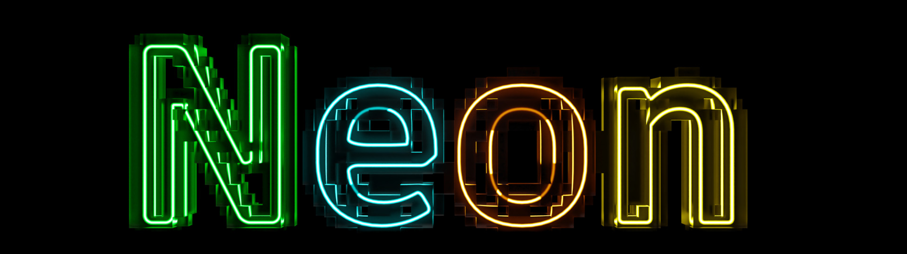

Neon is a research framework for programming multi-device systems maintained by [Autodesk Research](https://www.autodesk.com/research/overview). 
Neon's goal is to automatically transform user sequential code into, for example, a scalable multi-GPU execution.

To reach its goal, Neon takes a domain-specific approach based on the parallel skeleton philosophy (a.k.a parallel patterns). 
Neon provides a set of domain-specific and programmable patterns that users compose through a sequential programming model to author their applications. 
Then, thanks to the knowledge of the domain, the patterns and their composition, Neon automatically optimizes the sequential code into an execution optimized for multi-device systems. Currently, Neon targets grid-based computations on multi-core CPUs or single node multi-GPU systems.

!!! warning

    It is important to keep in mind that Neon is a research project in continuous evolution. 
    So, while we have successfully tested the system with different applications (Finite Difference, Finite Element, Lattice Boltzmann Method), Neon interfaces may change between versions to introduce new capabilities. 

The rest of the documentation is structured as follows:

**Learn:** 
: a set of simple blog-post-style tutorials to help new users to get used to Neon syntax and mechanisms. 

**References**
: information about the project, like publications, presentation, API documentation and performance analysis of the benchmarks included in Neon. 

**Gallery**
: a collection of plots, simulation outputs that showcase Neon capabilities on different applications

**Community**
: information of the community, from how to collaborate to Neon and to a list of current and past contributors. 
