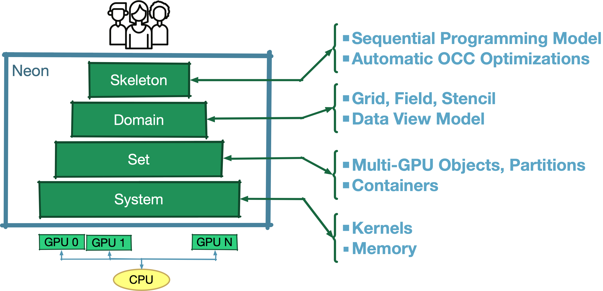

# Guided Tutorial - Introduction

Neon aims at making **multi-XPU** programming easier for computation on **volumetric data structure** by providing users
with a simple sequential programming model, while automatically applying varius optimizations under the hood.

Nowadays, accelerators are at the core of high performance computing and they   
 come in different types and configurations. Term **XPU** has been introduced as generic term to capture the diversity of accelerators, GPU, FPGA, TPU etc.
We target a collection of XPU computing accelerators that can be connected in shared memory or distributed fashion.
While this is the long-term scope of the project, at the moment, we support shared memory CPU and GPUs.
In particular, our current implementation is based on openMP (on the CPU) and CUDA (on GPU).

**Volumetric data** structures are used as a way to create a digital representation of properties of three-dimensional objects. For example, we can use them to represent pressure, displacement or material properties. Volumetric data structures are used both in simulation and computer graphics tools. 

Automatic parallelization of generic sequential code is still an open challenge which could be referred as the holy grail. 
Neon tackles a more tractable challenge by **restricting the problem to specific domains**. Neon focus on problems based on regular spatial discretions like uniform cartesian grids (support for non-uniform cartesian is in development). 

Moreover, Neon primarily support **local operations** like **map** (the value of a cell depends only on the metadata stored in the same cell) or **stencil** (a cell value is computed using metadata associated to close cells). Reductions (like dot or norm) are the only global operations. Thanks to the information on both the structure of volumetric representation and the supported operations, Neon is able to **automatically decompose the problem domain** in different partitions, map partition to the XPUs, handle any required communication between partitions and finally to decompose the computation **to introduce optimizations like overlapping computation and communication** which are essential to achieve good performance.  

In the following we run through a simple example to spread some light on what Neon does automatically under the hood.  

Consider a simple computation where apply a 

| Simple user application in Neon and its dependency graph                            |                                                                                     |
|-------------------------------------------------------------------------------------|-------------------------------------------------------------------------------------|
| <image src = "/learn/img/axpy-laplace-dot-code.png" width="300px"></image> | <image src = "/learn/img/axpy-laplace-dot-app.png" width="300px" ></image> |

| Different Multi-XPU Graph created by Neon                                   ||
|-----------------------------------------------------------------------------|----------------------------------------------------------------------------------------------|
| <image src = "/learn/img/axpy-laplace-dot-nocc.png" width="400px"></image> |<image src = "/learn/img/axpy-laplace-dot-eocc.png" width="400px"></image>  |
| <image src = "/learn/img/axpy-laplace-dot-socc.png" width="400px"></image> |<image src = "/learn/img/axpy-laplace-dot-e2occ.png" width="400px"></image> |

Neon is composed of a set of abstraction levels, each one represented by a C++ library.
The following picture shows the main high-level mechanisms provided by each level.

{ style="width:500"}

The Domain and Skeleton are the most important abstraction for Neon users.
As expected by its name, the Domain level introduces domain-specific mechanisms, as for now we target voxel based
computations and the mechanisms are Cartesian grids, fields and stencils. The Skeleton level provides users with a
sequential programming model and in charge of transforming and optimizing user applications to be deployed into a
multi-device system.

!!! Note

    To learn how to write an application with Neon, new users can mainly focus on the Domain and Skeleton documentation as it implicitelly covers all the nedded information from the other Neon abtraction levels. 

The following is the structure of the `Introduction and tutorial` section:

| Abstraction |           Description           |     Library     |                                   Link |
|-------------|:-------------------------------:|:---------------:|---------------------------------------:|
| System      |        Device management        |   libNeonSys    |   [info](the-bases/01-system-level.md) |
| Set         |     Multi device management     |   libNeonSet    |  [info](the-bases/02-the-set-level.md) |
| Domain      | Domain mechanism  - voxel grids |  libNeonDomain  |   [info](the-bases/03-domain-level.md) |
| Skeleton    |  Sequential programming model   | libNeonSkeleton | [info](the-bases/04-skeleton-level.md) |

