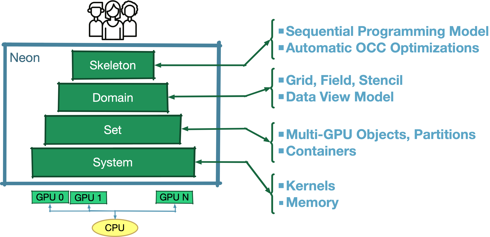

# Neon Structure

Neon is composed by a set of abstraction levels, each one represented by a C++ library. 
The following picture shows the main high level mechanisms provided by each level.

{ style="width:500"}

The Domain and Skeleton are the most important abstraction for Neon users. 
As expected by its name, the Domain level introduces domain specific mechanisms, as for now we target voxel based computations and the mechanism are Cartesian grids, fields and stencils. The Skeleton level provides users to a sequential programming model and in charge of transform and optimize user applications to be deployed into a multi-device system. 

!!! Note

    To learne how to write an application with Neon, new users can mainly focus on the Domain and Skeleton documentation as it implicitelly covers all the nedded information from the other Neon abtraction levels. 

The following is the structure of the `Introduction and tutorial` section:

| Abstraction   |      Description      |  Library |     Link |
|----------|:-------------:|:------:|------:|
| System |  Device management | libNeonSys | [info](02-the-system-level.md)|
| Set |    Multi device management   |   libNeonSet |[info](03-the-set-level.md)|
| Domain | Domain mechanism  - voxel grids |    libNeonDomain |[info](04-the-domain-level.md)|
| Skeleton | Sequential programming model |    libNeonSkeleton |[info](05-the-skeleton-level.md)|

