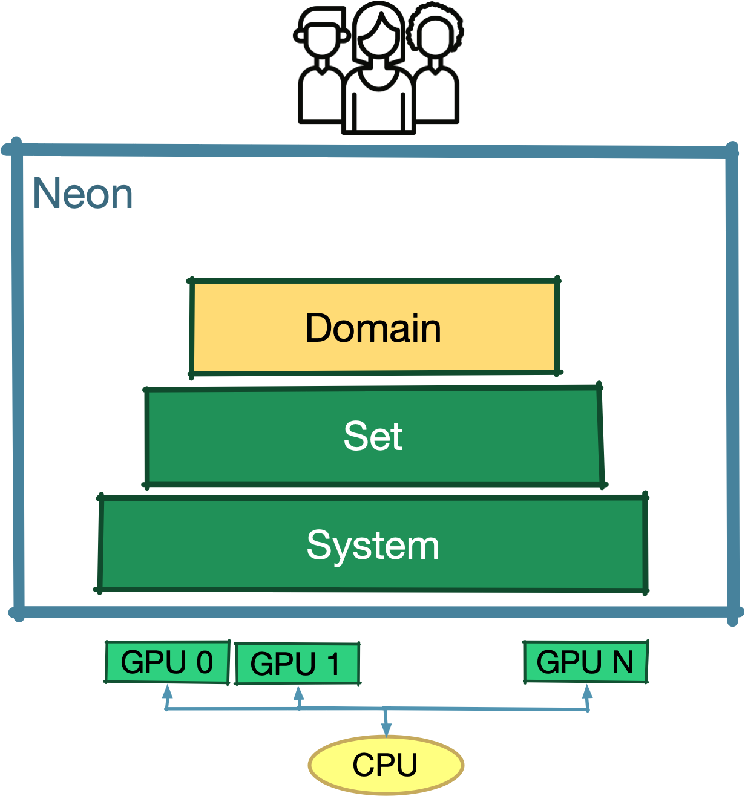
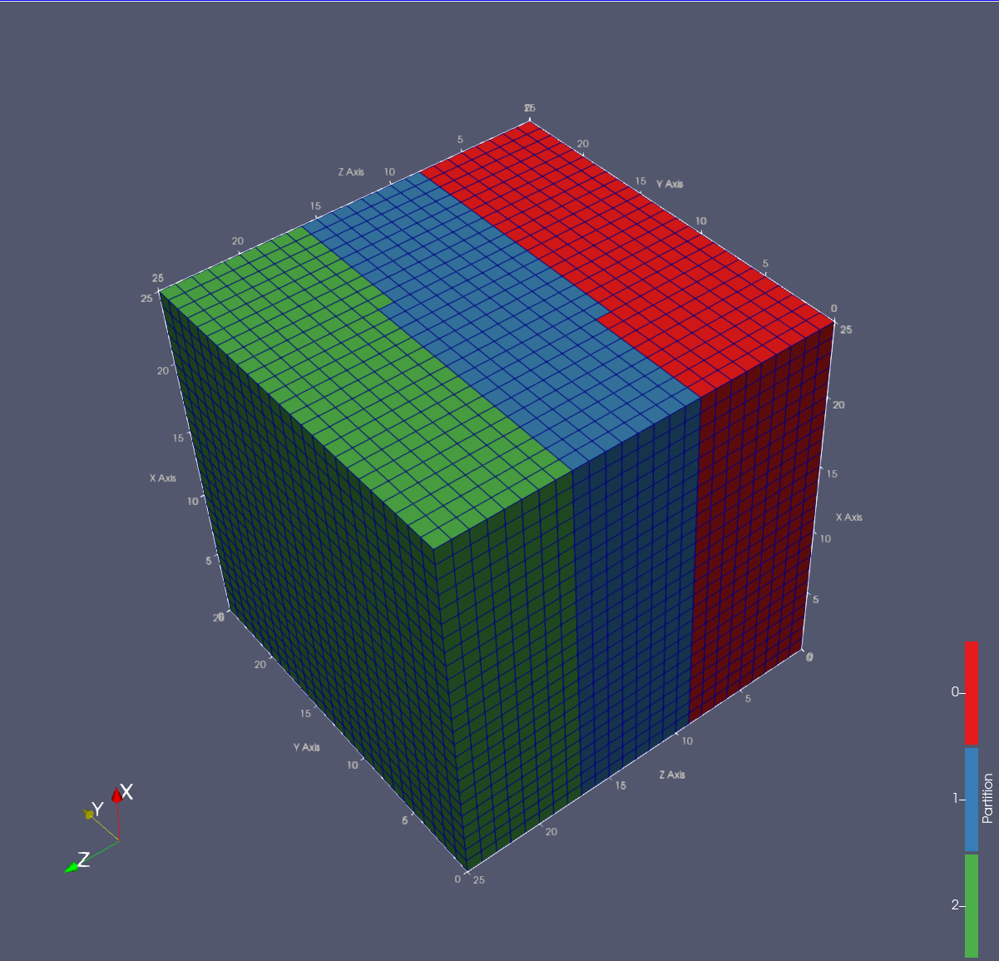
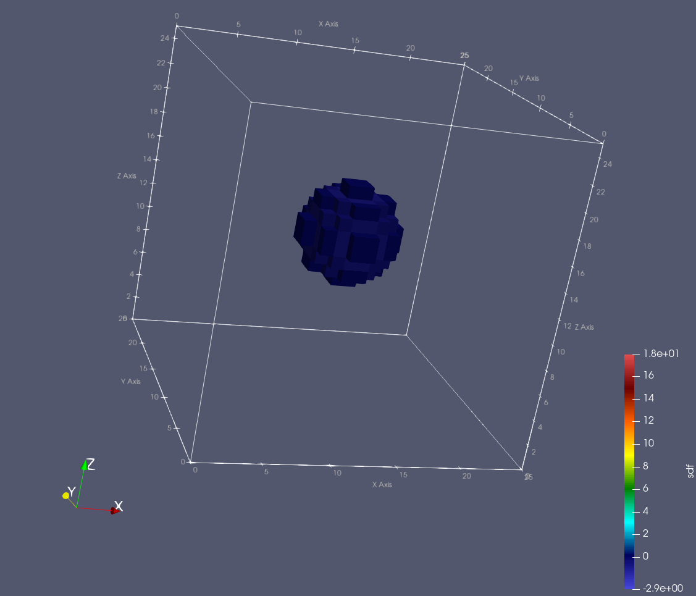
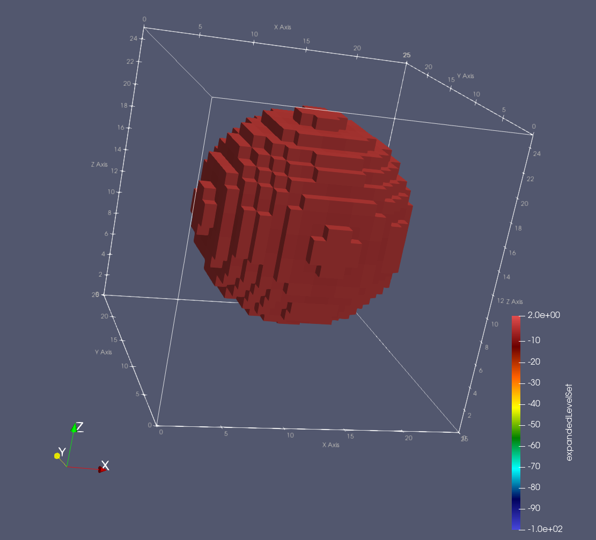
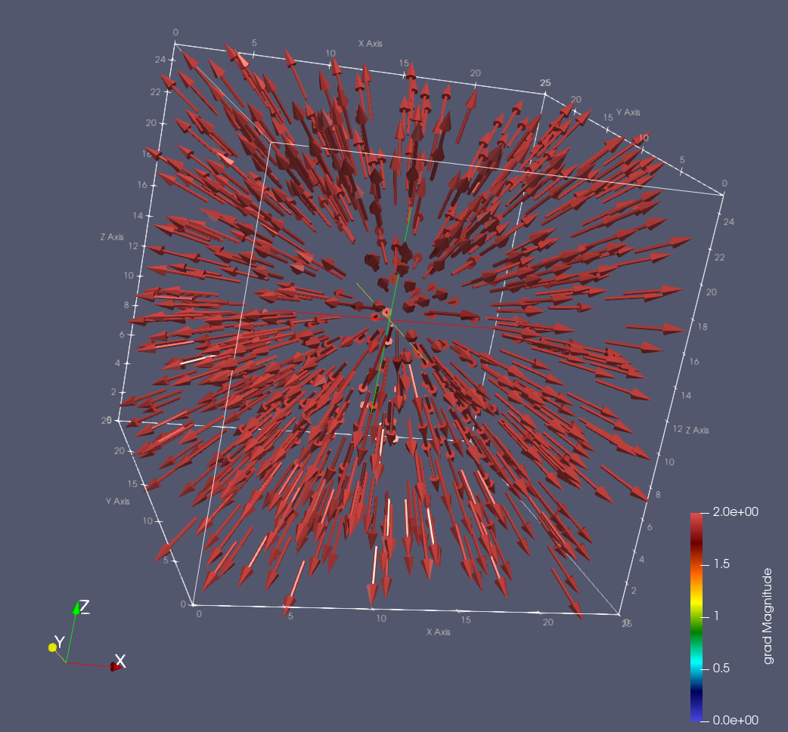

{ align=right style="width:250px"}

# The Domain Level

Neon Domain level's goal is to provide users with simple mechanisms for some specific domains.
Currently, Neon focus on those domains where a regular cartesian discretisations are leveraged.
Using a simple example will look ad how the level mechanisms can be used.

## Working with dense domains

Let's use implicit geometries to showcase some aspect of Neon.
Will be working on a domain that is dense where we define our implicit geometry.
The simpler implicic geometry we can use is a sphere.

Let's consider a simple example: a dense discrete domain where we implicitly want to represent a sphere through its
signed distance function.
We'll be looking at how to implement the following in Neon:

1. [**Neon backend**: choosing the hardware for the computation](#backend)
2. [**Neon grid**: setting up a dense cartesian domain](#cartesian)
3. [**Neon field**: initializing a sphere through its sdf](#field)
4. [**Neon map containers**: expanding the sphere via a level set](#mapContainers)
5. [**Neon stencil containers**: computing the grad of the level set field](#stencilContainers)

<a name="backend">
### **Neon backend**: choosing the hardware for the computation
</a>

Before starting with coding up out implicit geometries, we need to specify what hardware we want to use for the
computations.
The hardware selection process is introduced in the Set Level section.
Just briefly, through a `Neon::Backend` object, we declare the runtime type (CUDA streams or OpenMp) and a list of
resources IDs.
In this tutorial we target the first GPU in the system as a it's a more common configuration.
However, to still showcase the multi-GPU capabilities, we overbook the GPU three times.

!!! Note

    Performance wise, you should never overbook a GPU. 
    However it is a nice debugging configuration as it allows to check multi-GPU mechanism using a single GPU. 

```cpp linenums="26"  title="Neon/tutorials/introduction/domainLevel/domainLevel.cpp"
int main(int, char**)
{
    // Step 1 -> Neon backend: choosing the hardware for the computation
    Neon::init();
    // auto runtime = Neon::Runtime::openmp;
    auto runtime = Neon::Runtime::stream;
    // We are overbooking GPU 0 three times
    std::vector<int> gpu_ids{0, 0, 0};
    Neon::Backend    backend(gpu_ids, runtime);
    // Printing some information
    NEON_INFO(backend.toString());
    
    return 0;
}
```

!!! warning

    Remember always to call `Neon::init();` to ensure that the Neon runtime has been initialized. 
    The function can be call more than once. 

The following is the information printed on the terminal by the previous code.

``` bash title="Execution output" hl_lines="4"
$ ./tutorial-domainLevel 
[12:24:56] Neon: CpuSys_t: Loading info on CPU subsystem
[12:24:57] Neon: GpuSys_t: Loading info on GPU subsystem 1 GPU was detected.
[12:24:57] Neon: Backend_t (0x7fffdf107860) - [runtime:stream] [nDev:1] [dev0:0 NVIDIARTXA4000] 
```

In particular the last line describe the selected backend by providing the type, the number of devices as well as the
device name.
In this case we are working with a Nvidia A4000 GPU.


<a name="cartesian">
### **Neon grid**: setting up the cartesian discretisation
</a>

Defining a cartesian discretization is mostly a straight forward process.
The main information to provide are the dimension of the discretization (the grid),
declaring which are the cell in the discretization box that are of interest and the hardware to be used for any
computation.

The possibly uncommon parameter to provide is a stencil, which is computed as the union of all the stencil that will be
used
during computation on the grid. Because Neon is not compier-based, it relies on the user to provide such information
that is
critical for lots of aspects of the Neon computing model.

For our tutorial we extend the `domainLevel.cpp` file with the following lines of code.

```cpp linenums="36"  title="Neon/tutorials/introduction/domainLevel/domainLevel.cpp"
    // ...
    
    // Step 2 -> Neon grid: setting up a dense cartesian domain
    const int32_t  n = 25;
    Neon::index_3d dim(n, n, n);     // Size of the domain
    const double   voxelEdge = 1.0;  // Size of a voxel edge

    using Grid = Neon::domain::eGrid;  // Selecting one of the grid provided by Neon
    Neon::domain::Stencil gradStencil([] {
        // We use a center difference scheme to compute the grad
        // The order of the points is important,
        // as we'll leverage the specific order when computing the grad.
        // First positive direction on x, y and z,
        // then negative direction on x, y, z respectively.
        return std::vector<Neon::index_3d>{
            {1, 0, 0},
            {0, 1, 0},
            {0, 0, 1},
            {-1, 0, 0},
            {0, -1, 0},
            {0, 0, -1}};
    }());

    // Actual Neon grid allocation
    Grid grid(
        backend,  // <- Passing the target hardware for the computation
        dim,      // <- Dimension of the regular grid used for the discretizasion.
        [&](const Neon::index_3d&) -> bool {
            // We are looking for a dense domain,
            // so we are interested in all the points in the grid.
            return true;
        },             // <-  defining the active cells.
        gradStencil);  // <- Stencil that will be used during computations on the grid

    // Exporting some information
    NEON_INFO(grid.toString());
    grid.ioDomainToVtk("domain");
    
    return 0;
}
```

As stencil, we provide a Jacobi one, which will be using to compute the grad.

What we get on the terminal when running the previous code is the following output:

``` bash title="Execution output" hl_lines="5"
$ ./tutorial-domainLevel 
[12:54:11] Neon: CpuSys_t: Loading info on CPU subsystem
[12:54:11] Neon: GpuSys_t: Loading info on GPU subsystem 1 GPU was detected.
[12:54:11] Neon: Backend_t (0x7ffc0e6fad20) - [runtime:stream] [nDev:1] [dev0:0 NVIDIARTXA4000] 
[12:54:12] Neon: [Domain Grid]:{eGrid}, [Background Grid]:{(25, 25, 25)}, [Active Cells]:{15625}, [Cell Distribution]:{(15625)}, [Backend]:{Backend_t (0x55e6f57a2c70) - [runtime:stream] [nDev:1] [dev0:0 NVIDIARTXA4000] }
```

By logging the grid information (`NEON_INFO(grid.toString());`), we can inspect some information of the grid directly on
the terminal.
Indeed, the last line of output shows the selected grid type (eGrid in this case), the dimention of the grid, number of
active cells as well as the number of cell per hardware device.

By calling `ioDomainToVtk`, we can also inspect the created domain (`grid`) via Paraview as the code generates a vtk
file (`myDomain`).
The vtk file containes information on active cells and their distribution over selected hardware devices.
As we in the example we are using a reppresenting a dense domain, in the vtk file all the cell inside the grid will be
represented as active,
the more interesting information we can get from the vtk file is the mapping between cells and hardware devices as
reported in the following picture:



<a name="field">
### **Neon field**: defining data over the cartesian discretisation
</a>

Let's now allocate some metadata on top of the cartesian discretization we have just creates.
Neon field are the tool for the task. Fields are allocated from a Neon grid.
The type of a field depends on the metadata store on each cell.
A field can allocate a number of components for each cell. This number of components
which we call cardinality is defined when the field is created.

```cpp linenums="72" title="Neon/tutorials/introduction/domainLevel/domainLevel.cpp"
    //...
    
    // Step 3 -> Neon field: initializing a sphere through its signed distance function

    // Creating a scalar field over the grid.
    // Inactive cells will get associated with a default value of -100 */
    auto sphereSdf = grid.newField<double>("sphereSdf",  // <- Given name of the field.
                                           1,            // <- Number of field's component per grid point.
                                           -100);        // <- Default value for non active points.

    const double r = (n * voxelEdge / 2) * .3;

    // Using the signed distance function of a sphere to initialize the field's values
    // We leverage the forEachActiveCell method to easily iterate over the active cells.
    sphereSdf.forEachActiveCell([&](const Neon::index_3d& idx, int, double& value) {
        double sdf = sdfCenteredSphere(idx, dim, voxelEdge, r);
        value = sdf;
    });

    // Exporting some information of the sdf on terminal and on a vtk file. 
    NEON_INFO(sphereSdf.toString());
    sphereSdf.ioToVtk("sdf", "sdf");
    
    return 0;
}
```



<a name="mapContainers">
### **Neon map containers**: expanding the sphere via a level set
</a>

Let's now manipulate the sdf to expand zero level set of the sphere.
The operation can be simply implemented by adding a constant to all the cells of the grid.
The result will be a level set field (not a signed distance function).

Until now the values of the `sphereSdf` field are stored on the host,
indeed working on the host side is the only way we can do IO type of operations.
The process of moving data to the devices is simple as it requires only a simple mehtod call.

!!! Warning

    All Neon operation related to runnig computation or moving data have a asynchronous semantic.
    At the domain level it is up to the user to handle any sort of synchronization manually. 

```cpp linenums="93" title="Neon/tutorials/introduction/domainLevel/domainLevel.cpp"
    // ...
    
    // Step 4 -> Neon map containers: expanding the sphere via a level set

    // loading the sphereSdf to device
    sphereSdf.updateCompute(Neon::Backend::mainStreamIdx);

    // Run a container that ads a value to the sphere sdf
    // The result is a level set of an expanded sphere (not more a sdf)
    // We run the container asynchronously on the main stream
    expandedLevelSet(sphereSdf, 5.0).run(Neon::Backend::mainStreamIdx);

    // Moving asynchronously the values of the newly computed level set back
    // to export the result to vtk.
    sphereSdf.updateIO(Neon::Backend::mainStreamIdx);

    // Waiting for the transfer to complete.
    backend.sync(Neon::Backend::mainStreamIdx);

    // Exporting once again the fiel to vtk
    sphereSdf.ioToVtk("expandedLevelSet", "expandedLevelSet");
    
    return 0;
}
```

```cpp linenums="6" title="Neon/tutorials/introduction/domainLevel/expandSphere.cu"
template <typename Field>
auto expandedLevelSet(Field& sdf,
                 double expantion)
    ->Neon::set::Container
{
    return sdf.getGrid().getContainer(
        "ExpandedLevelSet", [&, expantion](Neon::set::Loader& L) {
            auto& px = L.load(sdf);

            return [=] NEON_CUDA_HOST_DEVICE(
                       const typename Field::Cell& cell) mutable {
                px(cell, 0) -= expantion;
            };
        });
}
```



<a name="mapContainstencilContainersers">
### Neon stencil containers: computing the grad of the level set field
</a>

```cpp linenums="113" title="Neon/tutorials/introduction/domainLevel/domainLevel.cpp"
    // ...
    
    // Step 5 -> Neon stencil containers: computing the grad of the level set field

    auto grad = grid.newField<double>("sphereSdf" , // <- Given name of the field.
                                      3, // <- Number of field's component per grid point.
                                      0); // <- Default value for non active points.

    Neon::set::HuOptions huOptions(Neon::set::TransferMode::get,
                                   true);
    sphereSdf.haloUpdate(huOptions);

    computeGrad(sphereSdf, grad, voxelEdge).run(Neon::Backend::mainStreamIdx);
    grad.updateIO(Neon::Backend::mainStreamIdx);
    backend.sync(Neon::Backend::mainStreamIdx);

    grad.ioToVtk("grad", "grad");
    
    return 0;
```

```cpp linenums="6" title="Neon/tutorials/introduction/domainLevel/expandSphere.cu"
template <typename Field>
auto computeGrad(const Field& sdfField,
                      Field&       gradField,
                      double       h)
    -> Neon::set::Container
{
    if(sdfField.getCardinality() != 1 || gradField.getCardinality()!= 3 ){
        NEON_THROW_UNSUPPORTED_OPERATION("Wrong cardinality detected.");
    }

    return sdfField.getGrid().getContainer(
        "computeGrad", [&, h](Neon::set::Loader& L) {
            auto&      sdf = L.load(sdfField);
            auto&      grad = L.load(gradField, Neon::Compute::STENCIL);
            const auto twiceOverH = 1. / h;


            return [=] NEON_CUDA_HOST_DEVICE(
                       const typename Field::Cell& cell) mutable {
                // Central difference
                for (int i = 0; i < 3; i++) {
                    auto upIdx = i;
                    auto dwIdx = i + 3;

                    auto [valUp, isValidUp] = sdf.nghVal(cell, upIdx, 0, 0);
                    auto [valDw, isValidDw] = sdf.nghVal(cell, dwIdx, 0, 0);

                    if (!isValidUp || !isValidDw) {
                        grad(cell, 0) = 0;
                        grad(cell, 1) = 0;
                        grad(cell, 2) = 0;
                        break ;
                    } else {
                        grad(cell, i) = (valUp - valDw) / twiceOverH;
                    }
                }
            };
        });
}
```

