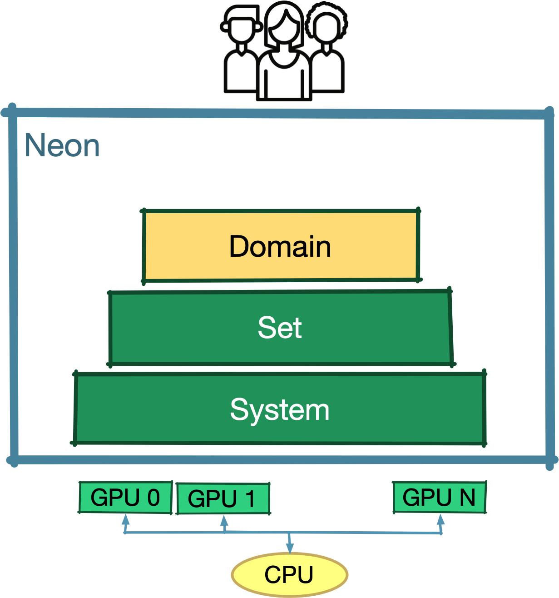

{ align=right style="width:250px"}

# Staggered Grids - Experimental [WIP]

Staggered grids are crucial for numerical methods like the finite element method.
Neon natively provides a staggered-grid abstraction over Neon uniform grids.
In other words, we can create a staggered grid using any of the uniform grids such as dGrid (dense), eGrid (sparse),
bGrid (sparse).

Node Grid and Voxel Grid are Neon's terminology to distinguish between the primal and dual grid of a staggered
configuration.
The following image is just a 2D example of a staggered grid for a sparse uniform discrete domain; the node grid is
highlighted in blue, and the voxel grid is in green.

<figure markdown>
  { width="300px" align=center}
  <figcaption></figcaption>
</figure>

Node Grid and Voxel Grid provide the same compute API that Neon uniform grids offer.
However, they also include functionality to jump from nodes to voxels and vice-versa.

Staggered grid provides mechanisms to create containers running on nodes or voxels.
The created containers are fully compatible with the Neon Skeleton model.

For this tutorial we want to showcase Neon StaggeredGrid mechanism with some simple operations,
where we represent temperature and density properties respectively on nodes and voxels.
The operations do not have actual physical meaning and their sole porpoise if to show some common type of computations
in a simple context.

- [** Step 0 - Initialization of a staggered grid **](#Initialization). The StaggeredGrid initialization process is
  slightly
  different than the ones of uniform grids.
  We will be using a small 2 by 3 by 9 voxel grid.
- [** Step 1 - Initialization of node and voxel fields **](#Node-and-voxel-fields). We'll be using nodes to store
  temperature
  and voxels to store material density.
- [** Step 2 - Access to neighbouring nodes **](#access-to-neighbouring-nodes-from-voxels). We'll be looping around the
  neighbouring nodes of a voxel to sum up their temperature values.
- [** Step 3 - Access to neighbouring voxels **](#access-to-neighbouring-voxels-from-nodes). We'll be accessing
  neighbouring
  voxels of a node to sum up their density values and to divide tha result by 8.
  The division by 8 will highlight some topological characteristics of the dual grids that we can use to confirm the
  actual results.

The code of the tutorial can be found in the Neon repository (`Neon/staggered-grid/tutorials/staggered-grids`).
As on the other tutorial in the rest will start from a emtpy main and we'll looking at how to implement the previous
steps.

<a name="Initialization">
## ** Step 0 - Initialization of a staggered grid **
</a>

The initialization code is straightforward. As always we first have to define the hardware configuration for the
execution by creating a `Backend` object.

Similarly to uniform grids, we also provide the dimension of the background grid and a
sparsity mask through a lambda function. For this last part of the process we target solely information of the voxel
grid. Thanks to the property of staggered grids, can reconstruct all the required information for the node grid.

Again as for the other Neon uniform grids, the last parameter is a list of stencil that will be used for computation on
the staggered grid. The stencil shape can be used either on the node and on the voxel grid.
Even with an empty stencil list, the staggered grid will include the support for stencil operation for node to
neighboring voxel and vice versa.

```cpp linenums="13" title="Neon/tutorials/staggered-grids/src/staggeredGrid.cpp"
int main()
{// Selecting the hardware for the computation
    Neon::Backend backend = [] {
        Neon::init();
        // Our XPU will be a CPU device.
        auto runtime = Neon::Runtime::openmp;
        // We are overbooking XPU 0 two times
        std::vector<int> gpu_ids{0, 0};
        Neon::Backend    backend(gpu_ids, runtime);
        return backend;
    }();

    // Define an alias for our staggered grid
    using UniformGrid = Neon::domain::dGrid;
    using StaggeredGrid = Neon::domain::internal::experimental::staggeredGrid::StaggeredGrid<UniformGrid>;
    using FP = double;
    using UserContainers = tools::Containers<StaggeredGrid, FP>;

    // Initializing a staggered grid based on dGrid
    StaggeredGrid grid = [&] {
        // Setting the dimension for the voxel grid
        Neon::int32_3d voxDims{2, 3, 9};

        // For our tutorial, we don't need to add new stencil.
        // By default, the staggered grid will add the stencil
        // to move from voxel to node and vice versa
        std::vector<Neon::domain::Stencil> noExtraStencils;

        StaggeredGrid newGrid(
            backend,
            voxDims,
            [](const Neon::index_3d&) -> bool {
                return true;
            },
            noExtraStencils);

        return newGrid;
    }();
    
    return 0;
}
```

<a name="Node-and-voxel-fields">
## ** Step 1 - Initialization of node and voxel fields **
</a>

We now extend the previous code with the initialization of the temperature and density fields.
The process is identical to the one used for uniform grids.

To make the things more interesting, we used two different method to initialize the two fields.
In the density case, we used the host side interface, while for the temperature the initialization
happens on the XPU side.

!!! Note

    The density fiels data have to manually be tranfered from the host to the XPUs, 
    bacause the initilization was done on the host size.

```cpp linenums="49" title="Neon/tutorials/staggered-grids/src/staggeredGrid.cpp"
    // ...

    auto density = [&grid] {
        // Defining a voxel field to represent the density of each voxel
        // We then set its initial values to zero in the host (CPU),
        // and finally we transfer the data to the XPU
        auto density = grid.template newVoxelField<FP, 1>("Density", 1, 0);
        density.forEachActiveCell([](const Neon::index_3d& /*idx*/,
                                     const int& /*cardinality*/,
                                     FP& value) {
            value = 0;
        });
        density.updateCompute(Neon::Backend::mainStreamIdx);
        return density;
    }();

    auto temperature = [&grid] {
        // Defining a node field to represent the temperature at each node
        // We then set its initial values to one, but to make it more interesting,
        // we do the initialization directly on the device calling a Containers.
        // Note that in this case we don't need to transfer data from host to XPUs
        auto temperature = grid.template newNodeField<FP, 1>("Temperature", 1, 0);
        temperature.forEachActiveCell([](const Neon::index_3d& /*idx*/,
                                         const int& /*cardinality*/,
                                         FP& value) {
            value = 0;
        });
        UserContainers::resetValue(temperature, FP(1.0)).run(Neon::Backend::mainStreamIdx);
        return temperature;
    }();

    // We define a simple function to export to vtk both
    // temperature and density field during each step of the tutorial.
    auto exportingToVti = [&](const std::string& tutorialStepId) {
        {  // Moving memory from XPUs to CPU
            temperature.updateIO(Neon::Backend::mainStreamIdx);
            density.updateIO(Neon::Backend::mainStreamIdx);
            backend.sync(Neon::Backend::mainStreamIdx);
        }
        {  // Exporting the results
            const std::string appName("staggered-grid");
            temperature.ioToVtk(appName + "-temperature-" + tutorialStepId, "temperature", false, Neon::IoFileType::BINARY);
            density.ioToVtk(appName + "-density-" + tutorialStepId, "density");
        }
    };

    // We are exporting to vtk the values of the fields after the initialization.
    // We expect all temperature nodes to be set to one,
    // and all density voxels to be set to zero.
    exportingToVti("0000");

    return 0;
}
```

The following is the code for the XPU side initialization of the temperature field shows how to
define a Neon Container on a staggered grid. The structure should result quite familiar at this point.
There are two minor changes that are highlighter in the code below.
Firstly, the method for creating a container is now specific for node and voxel grids (`getContainerOnNodes`
and `getContainerOnVoxel`). And finally, the parameter of the Neon Compute Lambda has changed
from `Idx`, to`Node` and `Voxel`.

```cpp linenums="40" title="Neon/staggered-grid/tutorials/staggered-grids/src/containers.cu" hl_lines="5 13"
template <typename StaggeredGrid, typename T>
auto Containers<StaggeredGrid, T>::resetValue(Self::NodeField  field,
                                              const Self::Type alpha) -> Neon::set::Container
{
    return field.getGrid().getContainerOnNodes(
        "addConstOnNodes",
        // Neon Loading Lamnbda 
        [&](Neon::set::Loader& loader) {
            auto& out = loader.load(field);

            // Neon Compute Lambda
            return [=] NEON_CUDA_HOST_DEVICE(const typename Self::NodeField::Node& e) mutable {
                for (int i = 0; i < out.cardinality(); i++) {
                    out(e, i) = alpha;
                }
            };
        });
}
```

In the main function code, just after the field initialization we added a helper function to export Staggered grid data
to XPU. The function takes also care of moving data from XPUs to host. Again the method to export to VTK is the same as
for uniform grids. To add some variety to the tutorial, temperature fields are exported in a VTK binary format.

The call to the export function at the end of the previous main function code show us how the data has been initialized.
As we can see from the following screenshot, temperature nodes are al set to 1 and density voxel to zero.


<a name="access-to-neighbouring-nodes-from-voxels">
## ** Step 2 - Access to neighbouring nodes **
</a>

Let's now focus on how to do some stencil computation, we for each temperature node we want to access the value of
neighbouring density voxels.

We know that the in Neon the identification of a neighbour Idx of a uniform grid is done through 3D offsets.
For example if I want to identify the cell on the left (in the positive X direction), we use the 3D offset {1,0,0}.
The same abstraction is valid for stencil operation between nodes or between voxels.

The 3D offset abstraction is extended also to jumps between node and voxel grids as shown by the following example in
2D.

<figure markdown>
  { width="400px" align=center}
  <figcaption></figcaption>
</figure>

!!! Notes

    - In a jump beteen node and voxel grids, only the niarest neightours can be accesses (stencil of radious one). 
    - The componed of a 3D offset for a grid jump are always 1 or -1, and 0 is not a valid option.
    - While the offset {1,1,1} can be both associated with a standard stencil operation and a grid jump, 
      the actual semantic is extracted by the context (i.e. the method it is called with).

Now that we know how 3D offsets are formalized for the jump between primal and dual grids like in the following snipped
of code, where we create container that sums up the temperature values of the neighboring nodes and stores it in the
voxel.

```cpp linenums="40" title="Neon/tutorials/staggered-grids/src/containers.cu" hl_lines="21-28"
template <typename StaggeredGrid, typename T>
auto Containers<StaggeredGrid, T>::sumNodesOnVoxels(Self::VoxelField&      densityField,
                                                    const Self::NodeField& temperatureField)
    -> Neon::set::Container
{
    return densityField.getGrid().getContainerOnVoxels(
        "sumNodesOnVoxels",
        // Neon Loading Lambda
        [&](Neon::set::Loader& loader) {
            auto&       density = loader.load(densityField);
            const auto& temperature = loader.load(temperatureField, Neon::Pattern::STENCIL);

            // Neon Pattern Lambda
            return [=] NEON_CUDA_HOST_DEVICE(const typename Self::VoxelField::Voxel& voxHandle) mutable {
                Type          sum = 0;
                constexpr int componentId = 0;

                // We visit all the neighbour nodes around voxHandle.
                // Relative discrete offers are used to identify the neighbour node.
                // As by construction all nodes of a voxel are active, we don't have to do any extra check.
                sum += temperature.template getNghNodeValue<1, 1, 1>(voxHandle, componentId);
                sum += temperature.template getNghNodeValue<1, 1, -1>(voxHandle, componentId);
                sum += temperature.template getNghNodeValue<1, -1, 1>(voxHandle, componentId);
                sum += temperature.template getNghNodeValue<1, -1, -1>(voxHandle, componentId);
                sum += temperature.template getNghNodeValue<-1, 1, 1>(voxHandle, componentId);
                sum += temperature.template getNghNodeValue<-1, 1, -1>(voxHandle, componentId);
                sum += temperature.template getNghNodeValue<-1, -1, 1>(voxHandle, componentId);
                sum += temperature.template getNghNodeValue<-1, -1, -1>(voxHandle, componentId);

                // Storing the final result in the target voxel.
                density(voxHandle, 0) = sum;
            };
        });
}
```

Now that we now have our container, we just need to extend our main function to run it, and export the data to vti to
check the result.

```cpp linenums="71" title="Neon/tutorials/staggered-grids/src/staggeredGrid.cpp"
    // ... 
    
    {  // Accessing voxels from nodes
       // For each node we loop around active voxel, and we sum their values.
       // At the end of this operation we expect all voxel to store a value of 8,
       // as there are 8 nodes for each voxel, each one set to one.
        UserContainers::sumNodesOnVoxels(density, temperature)
            .run(Neon::Backend::mainStreamIdx);

        exportingToVti("0001");
    }
        
    return 0;
}
```

!!! warning

    The `sumNodesOnVoxels` Container represents a stencil opertation, therefore the halo of the temperature field must be up to 
    date before executing the container.
    There are two wasy for addressing this, we can update the halo manually (as in the tutorial code) or we can use the Skeleton.
    In this tutorial we choose the first solution as we are showcasing mechanisms at the Domain level. Finally, the 
    halo update code is in the tutorial code but has not reported here as it is not the focus out topic: Staggered grids.

The resulting visualization of the results is not exciting, but it conforms that it confirms that the code is working:
all temperature nodes are still set to one as in the initialization step while all density voxel are now set to 8.
This is exactly the result we were expecting as each voxel is surrounded by exactly 8 voxels.


<a name="access-to-neighbouring-voxels-from-nodes">
## ** Step 3 - Access to neighbouring voxels **
</a>

In this last step we implement a container that given a nodes it fetches values from all the neighbouring density
voxels, sum them up, and it finally stores one with of the sum into the node temperature value.

```cpp linenums="49" title="Neon/tutorials/staggered-grids/src/containers.cu"
template <typename StaggeredGrid, typename T>
auto Containers<StaggeredGrid, T>::sumVoxelsOnNodesAndDivideBy8(Self::NodeField&        temperatureField,
                                                                const Self::VoxelField& densityField) -> Neon::set::Container
{
    return temperatureField.getGrid().getContainerOnNodes(
        "sumVoxelsOnNodesAndDivideBy8",
        // Neon Loading Lambda
        [&](Neon::set::Loader& loader) {
            const auto& density = loader.load(densityField, Neon::Pattern::STENCIL);
            auto&       temperature = loader.load(temperatureField);

            auto nodeSpaceDim = temperatureField.getGrid().getDimension();

            // Neon Pattern Lambda
            return [=] NEON_CUDA_HOST_DEVICE(const typename Self::NodeField::Node& nodeHandle) mutable {
                Type sum = 0;

                constexpr int componentId = 0;
                constexpr int returnValueIfVoxelIsNotActive = 0;

                // We visit all the neighbouring voxels around nodeHandle.
                // Relative discrete offers are used to identify the neighbour node.
                // Note that some neighbouring nodes may be not active.
                // Rather than explicitly checking we ask Neon to return 0 if the node is not active.
                sum += density.template getNghVoxelValue<1, 1, 1>(nodeHandle, componentId, returnValueIfVoxelIsNotActive).value;
                sum += density.template getNghVoxelValue<1, 1, -1>(nodeHandle, componentId, returnValueIfVoxelIsNotActive).value;
                sum += density.template getNghVoxelValue<1, -1, 1>(nodeHandle, componentId, returnValueIfVoxelIsNotActive).value;
                sum += density.template getNghVoxelValue<1, -1, -1>(nodeHandle, componentId, returnValueIfVoxelIsNotActive).value;
                sum += density.template getNghVoxelValue<-1, 1, 1>(nodeHandle, componentId, returnValueIfVoxelIsNotActive).value;
                sum += density.template getNghVoxelValue<-1, 1, -1>(nodeHandle, componentId, returnValueIfVoxelIsNotActive).value;
                sum += density.template getNghVoxelValue<-1, -1, 1>(nodeHandle, componentId, returnValueIfVoxelIsNotActive).value;
                sum += density.template getNghVoxelValue<-1, -1, -1>(nodeHandle, componentId, returnValueIfVoxelIsNotActive).value;

                // Storing the final result in the target node.
                temperature(nodeHandle, 0) = sum / 8;
            };
        });
}
```

The structure of the above Container is the similar to the previous one. However `getNghVoxelValue` has a different
signature. Indeed, while all nodes of a voxel are active by construction, the same is not true for the neighbouring
voxels of a node. Therefore `getNghVoxelValue` returns a structure that contains both the value of the neighbour node
field and an active flag.

Instead, explicitly checking if the neighbour voxel is active or not, we use the parameter of getNghVoxelValue, which
define value returned by the method for non-active voxels. We set the parameter to
zero (`returnValueIfVoxelIsNotActive`), which is the neutral element of the sum operator.

The final thing to is to run our new Container from the main function and export the resulting data to vtk as shown
below.

```cpp linenums="49" title="Neon/tutorials/staggered-grids/src/staggeredGrid.cpp"
    {  // Accessing nodes from voxels
       // For each voxel we loop around all nodes, we sum their values and divide the result by 8.
       // At the end of the container we expect to have the following values:
       // -- 1 for any corner node
       // -- 2 for any node on an edge of our domain
       // -- 3 for any node on a face
       // -- 4 for internal nodes
        UserContainers::sumVoxelsOnNodesAndDivideBy8(temperature,
                                                     density)
            .run(Neon::Backend::mainStreamIdx);

        exportingToVti("0002");
    }
    
    return 0;
}
```

!!! warning

    The `sumVoxelsOnNodesAndDivideBy8` Container represents a stencil opertation, therefore the halo of the temperature field must be up to 
    date before executing the container.


