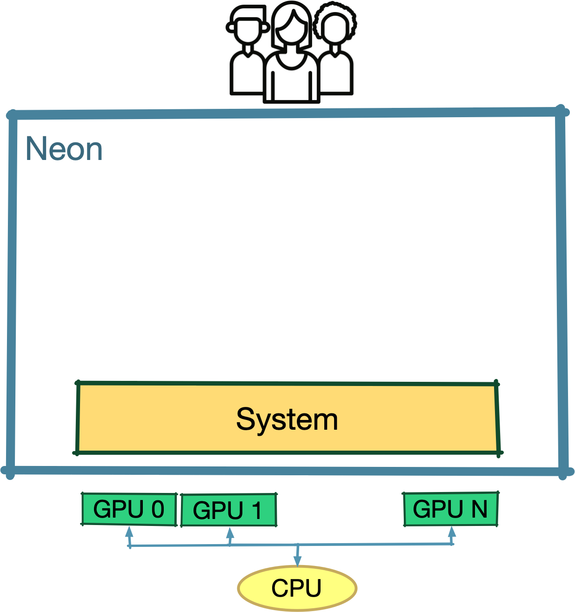

{align=right style="width:200px"}

# The System Level

The **System** abstraction shields the rest of Neon from architecture and hardware-specific mechanisms.
This abstraction level should be entirely invisible to the final Neon users.

The System defines an object-oriented interface to manage resources and requires the following back end capabilities:

**Memory Management**:
    This allows Neon to create device buffers and move data between devices or the host.

**Queue-based Run-time Model**:
    Neon uses a queue-based model to abstract asynchronous kernels running on the same device. 
    It is a generic model widely used at the hardware level e.g., in CUDA, Streams represent command queues, while Events are the mechanism to inject dependencies between different queues.

**Lambda Functions**: 
    Neon leverages the expressiveness of lambda functions to lessen the complexity of authoring multi-GPU applications.

Therefore, only the Neon System abstraction must be implemented to port Neon to a new accelerator that exposes the previous mechanisms. All the higher levels are not impacted.
