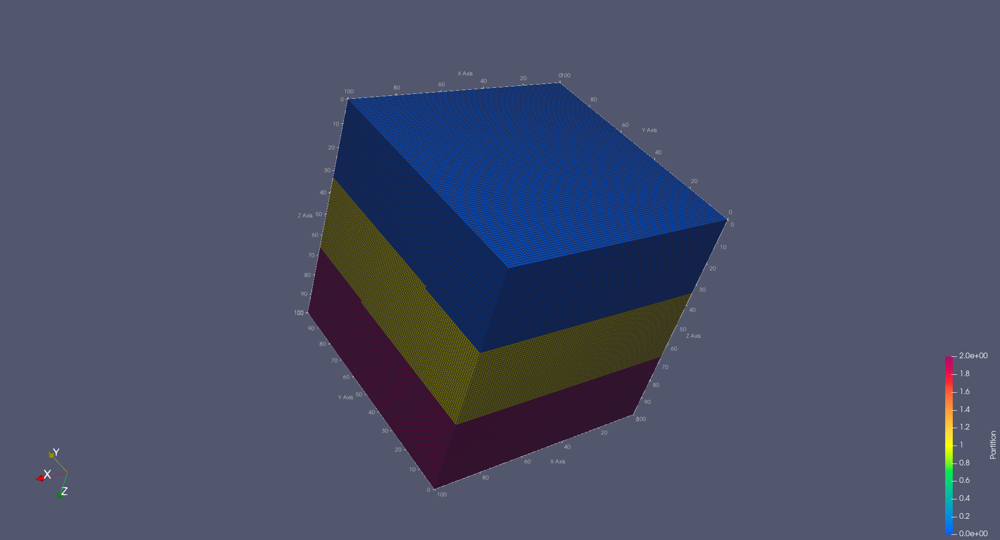
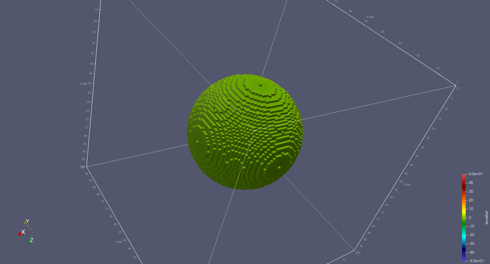
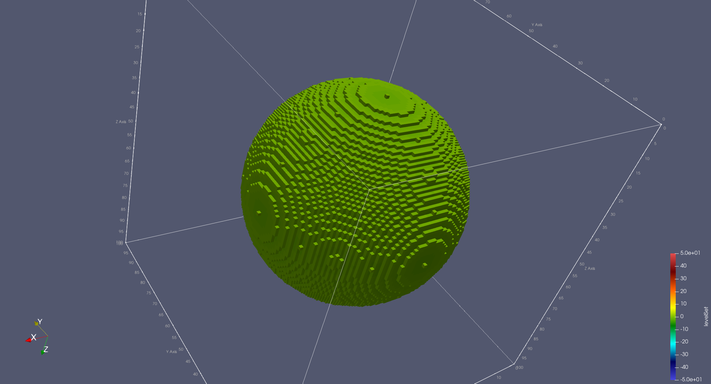
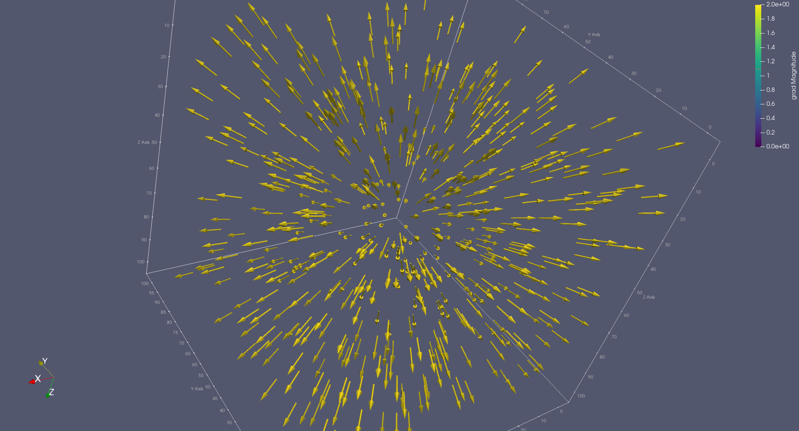

{ align=right style="width:250px"}

# The Domain Level

Neon Domain level's goal is to provide users with simple mechanisms for some specific domains.
Currently, Neon focus on those domains where a regular cartesian discretizations are leveraged.
Using a simple example will look at how the level mechanisms can be used.

## Working with dense domains

Let's use aspects of implicit geometries and the finite difference method to check out some elements of Neon.
Our goal for this tutorial is to first define a sphere on a discrete dense domain via the level set method, then design
two operators: one to expand the sphere and the other to compute its gradient.

We divide the tutorial in the following steps steps:

1. [**Neon backend** - Choosing the hardware for the computation](#backend)
2. [**Neon grid** - Setting up a dense cartesian discretization](#cartesian)
3. [**Neon field** - Initializing the level set of a sphere](#field)
4. [**Neon map containers** Expanding the sphere](#mapContainers)
5. [**Neon stencil containers** - Computing the grad of the sphere](#stencilContainers)

The complete code of the tutorial is located in the `Neon/tutorials/introduction/domainLevel` directory. However, in the
following, we'll start with an empty main function and guide you step by step.

<a name="backend">
### **Neon backend**: choosing the hardware for the computation
</a>

We start our program by specifying the hardware we want to use. The process is introduced in depth by the Neon Set Level
section.

```cpp linenums="26"  title="Neon/tutorials/introduction/domainLevel/domainLevel.cpp"
int main(int, char**)
{
    // Step 1 -> Neon backend: choosing the hardware for the computation
    Neon::Backend backend = [] {
        Neon::init();
        // auto runtime = Neon::Runtime::openmp;
        auto runtime = Neon::Runtime::stream;
        // We are overbooking XPU 0 three times
        std::vector<int> xpuIds{0, 0, 0};
        Neon::Backend    backend(xpuIds, runtime);
        // Printing some information
        NEON_INFO(backend.toString());
        return backend;
    }();
    
    return 0;
}
```

Just briefly, through a `Neon::Backend` object, we declare the runtime type (CUDA streams or OpenMP) and a list of
resources IDs.
In our example, we target the first GPU in the system (GPU ID 0) as it's a typical configuration; however, we overbook
the GPU three times to showcase the multi-GPU capabilities.

!!! Note

    Overbooking a GPU can have a negative impact on performance.  
    However, checking out (or debugging) multi-GPU mechanisms using a single GPU is quite handy.

Finally, before returning from the main, we also log some hardware information on the terminal to check that everything
is as expected.

!!! warning

    Remember always to call `Neon::init();` to ensure that the Neon runtime has been initialized. 
    The function can be call more than once. 

By testing out our first code draft, we get the following output on the terminal:

``` bash title="Execution output" hl_lines="4"
$ ./tutorial-domainLevel 
[20:33:16] Neon: CpuSys_t: Loading info on CPU subsystem
[20:33:16] Neon: GpuSys_t: Loading info on GPU subsystem 2 GPUs were detected.
[20:33:16] Neon: Backend_t (0x7ffd171aad40) - [runtime:stream] [nDev:3] [dev0:0 NVIDIARTXA6000] [dev1:0 NVIDIARTXA6000] [dev2:0 NVIDIARTXA6000] 
```

In particular, the last line describes the selected backend by providing the type, the number of devices as well as the
device name.
In this case, we are working on an Nvidia A4000 GPU.

<a name="cartesian">
### **Neon grid**: setting up the cartesian discretization
</a>

Let's now extend our previous code by defining a cartesian discretization for our problem; for example, let's create our
sphere on top of a 100^3 grid.

```cpp linenums="39"  title="Neon/tutorials/introduction/domainLevel/domainLevel.cpp"
    // ...
    
    // Step 2 -> Neon grid: setting up a 100^3 dense cartesian domain
    const int32_t  n = 100;
    Neon::index_3d dim(n, n, n);     // Size of the domain
    const double   voxelEdge = 1.0;  // Size of a voxel edge

    using Grid = Neon::domain::eGrid;  // Selecting one of the grid provided by Neon
    Grid grid = [&] {
        Neon::domain::Stencil gradStencil([] {
            // We use a center difference scheme to compute the grad
            // The order of the points is important,
            // as we'll leverage the specific order when computing the grad.
            // First positive direction on x, y and z,
            // then negative direction on x, y, z respectively.
            return std::vector<Neon::index_3d>{
                {1, 0, 0},
                {0, 1, 0},
                {0, 0, 1},
                {-1, 0, 0},
                {0, -1, 0},
                {0, 0, -1}};
        }());

        // Actual Neon grid allocation
        Grid grid(
            backend,  // <- Passing the target hardware for the computation
            dim,      // <- Dimension of the regular grid used for the discretizasion.
            [&](const Neon::index_3d&) -> bool {
                // We are looking for a dense domain,
                // so we are interested in all the points in the grid.
                return true;
            },             // <-  defining the active cells.
            gradStencil);  // <- Stencil that will be used during computations on the grid

        // Exporting some information
        NEON_INFO(grid.toString());
        grid.ioDomainToVtk("domain");

        return grid;
    }();
    
    return 0;
}
```

Neon Domain provides various grid implementations, and they all share the same interface. Dense, element sparse and
block sparse are some of the provided grids (description and comparison of all the grids are under work). In our
example, we selected an element sparse grid (Neon::domain::eGrid); however, we create a C++ alias instead of directly
using the grid type (line 43). This approach allows us to switch in the future from one grid to another by just
redefining the alias.

!!! Note

	Switching from one grid to another, like in the example, is done at compile time. Neon does not directly support dynamic grid switching. However, it can be implemented by the users via std::variant.

The main information to provide is:

For the initialization of the grid (line 108), we provide the following information:

- dimension of the discretization box,
- the set of cells of the discretization box that we are interested in,
- the hardware to be used for any computation,
- and finally a stencil which is basically defined as a vector of offsets (line 44).

A stencil may be seen as an uncommon parameter to provide as part of a grid initialization.
The stencil is the union of all the stencils that are used by any computation on the grid.

Neon uses the stencil information for many critical optimization aspects. An ad-hoc compiler could automatically extract
what stencil are used. However, Neon is developed as a C++ library, so it must rely on the user to retrieve such
information.

Running again the tutorial with the additional code lines we obtain the following output:

``` bash title="Execution output" hl_lines="5"
$ ./tutorial-domainLevel 
[20:33:16] Neon: CpuSys_t: Loading info on CPU subsystem
[20:33:16] Neon: GpuSys_t: Loading info on GPU subsystem 2 GPUs were detected.
[20:33:16] Neon: Backend_t (0x7ffd171aad40) - [runtime:stream] [nDev:3] [dev0:0 NVIDIARTXA6000] [dev1:0 NVIDIARTXA6000] [dev2:0 NVIDIARTXA6000] 
[20:33:18] Neon: [Domain Grid]:{eGrid}, [Background Grid]:{(100, 100, 100)}, [Active Cells]:{1000000}, [Idx Distribution]:{(333334,333333,333333)}, [Backend]:{Backend_t (0x55ce949fd450) - [runtime:stream] [nDev:3] [dev0:0 NVIDIARTXA6000] [dev1:0 NVIDIARTXA6000] [dev2:0 NVIDIARTXA6000] }
```

By logging the grid information (`NEON_INFO(grid.toString());` on line 71), we can check some information about the
grid.
The last terminal line shows the selected grid type (eGrid in this case), the dimension of the grid, the number of
active cells, as well as the number of cells per XPU.

By calling `ioDomainToVtk` method, we can also inspect the created domain (`grid`) via Paraview as the code generates a
vtk file (`domain`). With an application working on a dense domain, the Paraview will show all the cells in the
discretization box as active. Moreover, it will show the mapping between cells and hardware devices as
reported in the following picture:



<a name="field">
### **Neon field**: defining data over the cartesian discretization
</a>

Let's now create some metadata on top of our 100^3 cartesian discretization to store the level set of a sphere. Neon
fields, which are allocated from a Neon grid, are the tool for the task.
A Neon field is characterized by the type of each cell and the number of components stored in each cell (we call it
cardinality of the field). The cell type is defined at compile time, while cardinality can be defined either at compile
time or at runtime. In our example, we use the runtime version.

```cpp linenums="80" title="Neon/tutorials/introduction/domainLevel/domainLevel.cpp"
    //...
    
    // Step 3 -> Neon field: initializing a sphere through its signed distance function

    auto sphere = [dim, n, voxelEdge, &grid] {
        // Creating a scalar field over the grid.
        // Inactive cells will get associated with a default value of -100 */
        auto sphere = grid.newField<double>("sphere",  // <- Given name of the field.
                                            1,         // <- Number of field's component per grid point.
                                            -100);     // <- Default value for non active points.

        const double r = (n * voxelEdge / 2) * .5;

        // We initialize the field with the level set of a sphere.
        // We leverage the forEachActiveCell method to easily iterate over the active cells.
        sphere.forEachActiveCell([&](const Neon::index_3d& idx, int, double& value) {
            double sdf = sdfCenteredSphere(idx, dim, voxelEdge, r);
            value = sdf;
        });
        return sphere;
    }();

    // Exporting some information of the level set field on terminal and on a vtk file.
    NEON_INFO(sphere.toString());
    sphere.ioToVtk("sphere-levelSet", "levelSet");

    
    return 0;
}
```



<a name="mapContainers">
### **Neon map containers**: expanding the sphere via a level set
</a>

Let's now manipulate the sdf to expand zero level set of the sphere.
The operation can be simply implemented by adding a constant to all the cells of the grid.
The result will be a level set field (not a signed distance function).

At the moment the values of the `sphere` field are stored on the host,
indeed working on the host side is the only way we can do IO type of operations on Neon grids.
To move the data to the XPUs for the computation we just need to call the `updateIO`method.

!!! Warning

    All Neon operations related to runnig computation or moving data have a asynchronous semantic.
    At the domain level it is up to the user to handle any sort of synchronization manually. 

```cpp linenums="104" title="Neon/tutorials/introduction/domainLevel/domainLevel.cpp"
    // ...
    
    // Step 4 -> Neon map containers: expanding the sphere via a level set

    {  // loading the sphere to XPUs
        sphere.updateCompute(Neon::Backend::mainStreamIdx);
    }
    // Run a container that adds a value to the sdf sphere.
    // The result is a level set of an expanded sphere (not more a sdf).
    // We run the container asynchronously on the main stream
    expandLevelSet(sphere, 9.0).run(Neon::Backend::mainStreamIdx);

    {  // Moving asynchronously the values of the newly computed
        // level set values to the host
        sphere.updateIO(Neon::Backend::mainStreamIdx);
        // Waiting for the transfer to complete.
        backend.sync(Neon::Backend::mainStreamIdx);
        // Exporting once again the field to vtk
        sphere.ioToVtk("extended-sphere-levelSet", "levelSet");
    }
    
    return 0;
}
```

The `expandLevelSet` method returns a Neon Container, which is the equivalent of a kernel in CUDA. A Neon Container
executes in parallel a computation over all the XPU devices defined by the Backend.
The following is the structure of the Container used to expand our sphere.

A Container can be generated from a Neon grid and is composed by two parts: a Loading Lambda where user declare what
files are going to be used for the computation and a Compute Lambda, which contains the actual XPU code.

Once a field is loaded we can read and write its values by using a reference to a `Idx` (which is passed to the Compute
Lambda by the Neon runtime) and specifying what component of the field we are interested in.
Once a Container is created, it can be executed by calling the `run` method (see the above code).

```cpp linenums="6" title="Neon/tutorials/introduction/domainLevel/expandLevelSet.cu"
template <typename Field>
auto expandLevelSet(Field& sdf,
                    double expansion)
    -> Neon::set::Container
{
    return sdf.getGrid().getContainer(
        "ExpandLevelSet",
        // Neon Loading Lambda
        [&, expansion](Neon::set::Loader& L) {
            auto& px = L.load(sdf);

            // Neon Compute Lambda
            return [=] NEON_CUDA_HOST_DEVICE(
                       const typename Field::Idx& cell) mutable {
                px(cell, 0) -= expansion;
            };
        });
}
```



<a name="mapContainstencilContainersers">
### Neon stencil containers: computing the grad of the level set field
</a>

```cpp linenums="123" title="Neon/tutorials/introduction/domainLevel/domainLevel.cpp"
    // ...
    
    // Step 5 -> Neon stencil containers: computing the grad of the level set field
    auto grad = grid.newField<double>("grad",  // <- Given name of the field.
                                      3,       // <- Number of field's component per grid point.
                                      0);      // <- Default value for non active points.

    Neon::set::HuOptions huOptions(Neon::set::TransferMode::get,
                                   true);
    sphere.haloUpdate(huOptions);

    // Execution of a container that computes the gradient of the sphere
    computeGrad(sphere, grad, voxelEdge).run(Neon::Backend::mainStreamIdx);

    {  // Moving the grad data onto the host and exporting it to vtk
        grad.updateIO(Neon::Backend::mainStreamIdx);
        backend.sync(Neon::Backend::mainStreamIdx);
        grad.ioToVtk("extended-sphere-grad", "grad");
    }

    return 0;
```

```cpp linenums="6" title="Neon/tutorials/introduction/domainLevel/expandSphere.cu"
/**
 * A function that generates a Neon Container to compute the grad over a scalar field.
 * Note: in Neon only constant field can be used as input for stencil computation
 */
template <typename Field>
auto computeGrad(const Field& levelSetField /** input scalar field we want to compute the grad.*/,
                 Field&       gradField /** input scalar field we want to compute the grad.*/,
                 double       h)
    -> Neon::set::Container
{
    if (levelSetField.getCardinality() != 1 || gradField.getCardinality() != 3) {
        // We check that the level set field is a scalar field,
        // while the gradient is a three component field.
        NEON_THROW_UNSUPPORTED_OPERATION("Wrong cardinality detected.");
    }

    // The following Neon compute-lambda works with the assumption that the first elements of the stencil
    // given to the grid initialization are as follow:
    //
    //      {1, 0, 0},
    //      {0, 1, 0},
    //      {0, 0, 1},
    //      {-1, 0, 0},
    //      {0, -1, 0},
    //      {0, 0, -1}
    return levelSetField.getGrid().getContainer(
        "computeGrad",
        // Neon Loading Lambda
        [&, h](Neon::set::Loader& L) {
            // Loading the sdf field for a stencil type of computation
            // as we will be using a 6 point stencil to compute the gradient
            auto& levelSet = L.load(levelSetField, Neon::Compute::STENCIL);
            auto& grad = L.load(gradField);

            // We can nicely compute the inverse of the spacing in the loading lambda
            const auto oneOverTwoH = 1. / (2.0 * h);

            // Neon Compute Lambda
            return [=] NEON_CUDA_HOST_DEVICE(
                       const typename Field::Idx& cell) mutable {
                // Central difference
                for (int i = 0; i < 3; i++) {
                    auto upIdx = i;
                    auto dwIdx = i + 3;

                    auto [valUp, isValidUp] = levelSet.nghVal(cell, upIdx, 0, 0);
                    auto [valDw, isValidDw] = levelSet.nghVal(cell, dwIdx, 0, 0);

                    if (!isValidUp || !isValidDw) {
                        grad(cell, 0) = 0;
                        grad(cell, 1) = 0;
                        grad(cell, 2) = 0;
                        break;
                    } else {
                        grad(cell, i) = (valUp - valDw) / oneOverTwoH;
                    }
                }
            };
        });
}
```



[Staggered Grids](../staggered-grids/staggered-grid.md)

