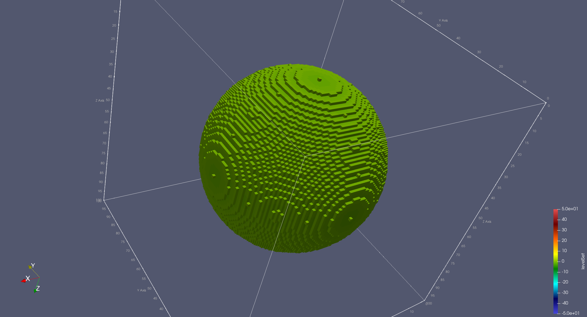

{ align=right  style="width:200px"}
# The Skeleton Level




<a name="mapContainstencilContainersers">
### Neon stencil containers: computing the grad of the level set field
</a>

```cpp linenums="113" title="Neon/tutorials/introduction/domainLevel/domainLevel.cpp"
   // ...

    Neon::skeleton::Skeleton skl(data.getBackend());
    Neon::skeleton::Options  opt(occ, transfer);
    auto                     fR = data.getGrid().template newPatternScalar<T>();

    fR() = scalarVal;

    data.getBackend().syncAll();


    {  // SKELETON
        auto& X = data.getField(FieldNames::X);
        auto& Y = data.getField(FieldNames::Y);

        skl.sequence({UserTools::axpy(fR, Y, X),
                      UserTools::laplace(X, Y),
                      data.getGrid().dot("DotContainer", Y, Y, fR)},
                     appName, opt);

        skl.ioToDot(appName + "_" + Neon::skeleton::OccUtils::toString(opt.occ()));

        timer.start();
        for (int i = 0; i < nIterations; i++) {
            skl.run();
        }
        data.getBackend().syncAll();
        timer.stop();
    }


```
