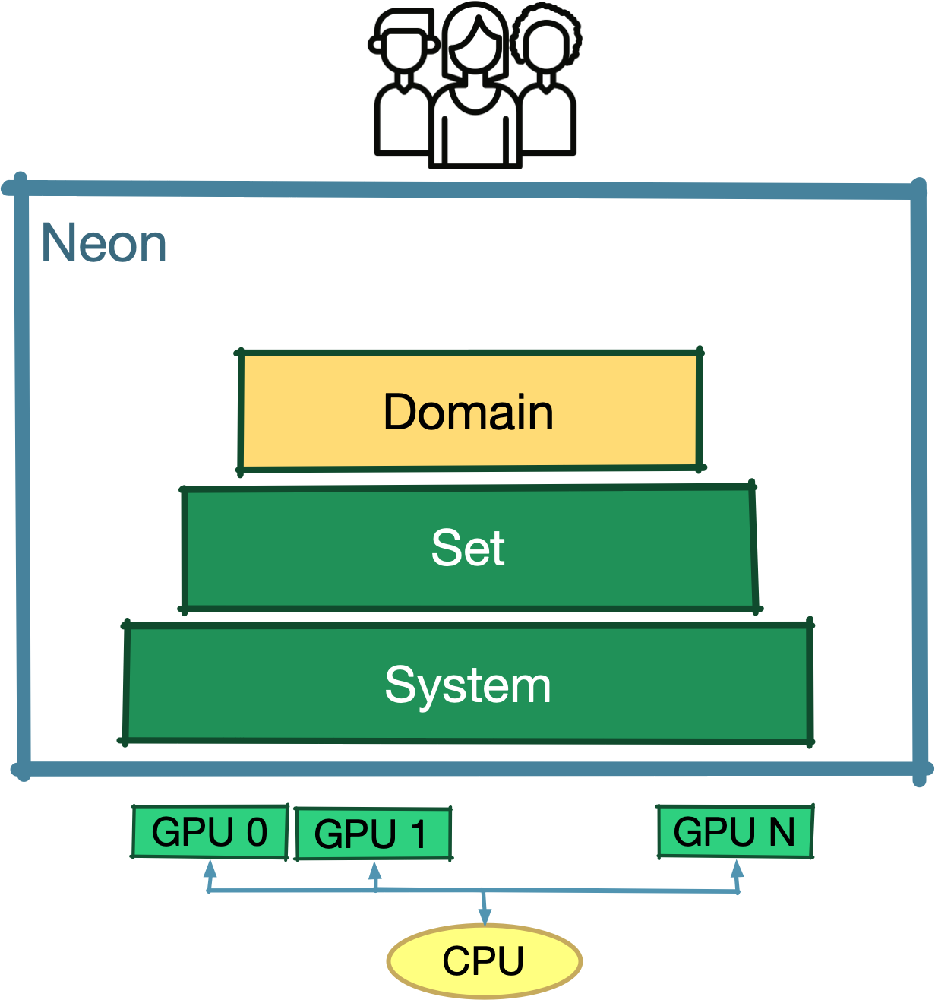

{ align=right  style="width:200px"}
# The Domain Level

Neon Domain level's goal is to provide users with simple mechanisms for some specific domains. 
Currently, Neon focus on those domains where a regular cartesian discretisations are leveraged. 
Using a simple example will look ad how the level mechanisms can be used. 

## The implicit representation of a hollow sphere's quadrant

ALet's consider a 3D domain $\Omega$ that we want to discrete over a regular grid. 
Leveraging constructive solid geometry, we define $\Omega$ as a quadrant of a hollow shere. 
For simplicity, we place the center of the hollow sphere at the origin. 

$$\Omega = \{ \forall a \in R^3  ; |a|\geq r_1^2 \wedge |a|	\leq r_2^2 \wedge a_x \geq 0, a_y \geq 0, a_z \geq 0, \}$$ 

In the following will look at how to

* define a discrete version of $\Omega$ through **Neon Grids**
* define some scalar and vector data on top of $\Omega$ through **Neon Fields**
* run define some computations over the data fields through **Neon Containers**

## Neon Grids

## Neon Fields

## Neon Containers on Grids